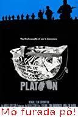
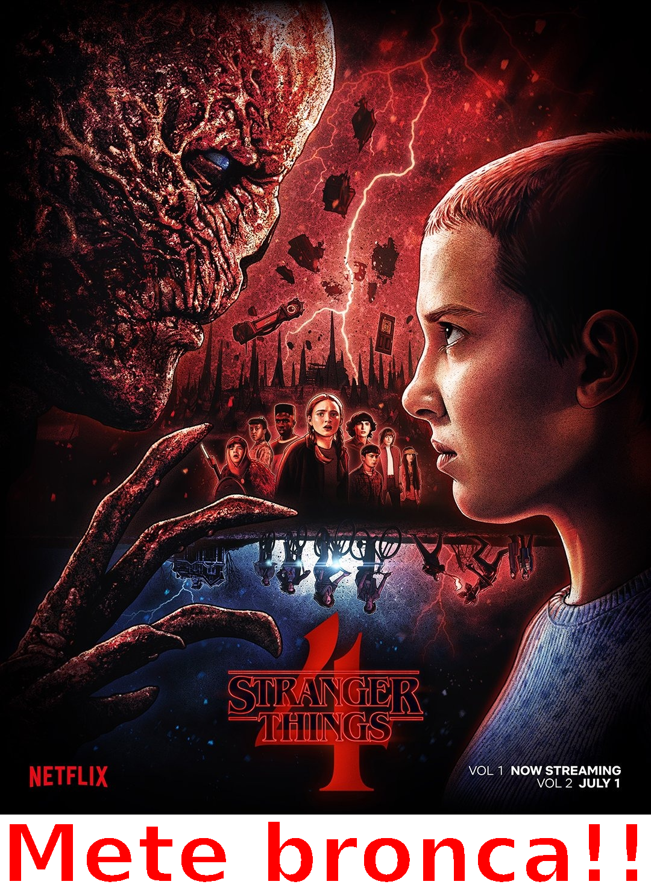
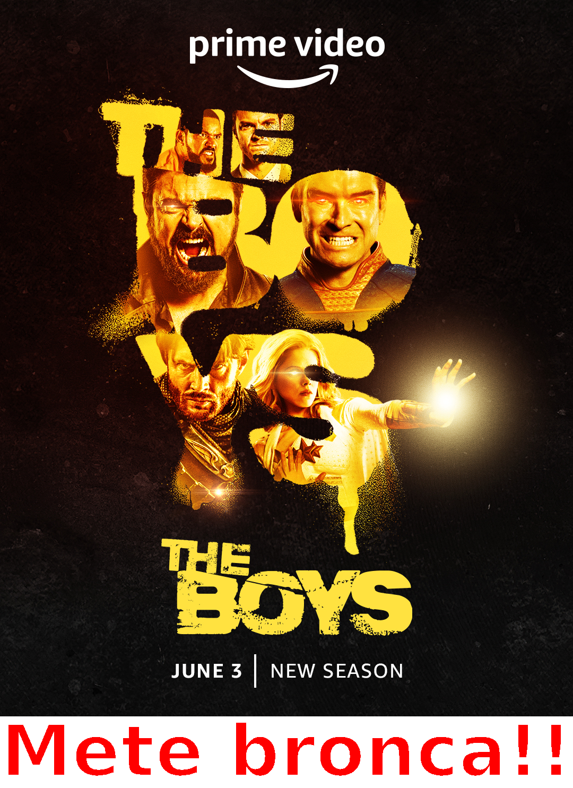

# Imersão Alura Java_☕

- [x] Dia 1:

 * Nessa etapa foi utilizada a [api do IMDB](https://imdb-api.com/) requisitando o endpoint que retorna os 250 melhores filmes. Para isso foi utilizado o pacote [java.net](https://docs.oracle.com/javase/7/docs/api/java/net/package-summary.html) que fornece todas as ferramentas para estabelecer a conexão client-server.<br>
 * Também foi utilizada a biblioteca Gson do google para desserializar o JSON da requisição e armazenar as informções em objetos Java.
 
 Resultado:
 
<p align="center">
  
  
</p>
 
 - [x] Dia 2:

* No segundo dia foram utilizadas as imagens disponíveis nos dados da requisição (JSON) para a criação de figurinhas. Com o auxílio dos pacotes [java.awt](https://docs.oracle.com/javase/7/docs/api/java/awt/package-summary.html), [java.io](https://docs.oracle.com/javase/7/docs/api/java/io/package-summary.html) e [java.ImageIO](https://docs.oracle.com/javase/7/docs/api/javax/imageio/ImageIO.html) foi possível realizar a edição das imagens e a inserção de textos.
* Uma classificação simples baseada no `IMDB Rating` foi aplicada onde para filmes com baixa pontuação é atribuído o comentário "Mó furada pô!", para os filmes intermediários "Dá pra ir..." e os filmes de maior pontuação "Mete bronca!!". A mesma metodologia foi aplicada aos programas de Tv.
* Para persistência dos dados foi criada uma pasta `saida/imdb` onde as figurinhas geradas podem ser exportadas no formato png.

Resultado (Filmes):

<p align="center">
  
  
  
</p>

Resultado (Tv's Shows):

<p align="center">
  
  
  
</p>

- [ ] Dia 3:

  *******
 **Caminho do repositório:**
 ```
├── src
│   ├── main
│       ├── java
│           ├── com.br.aluraStickers
 ````

